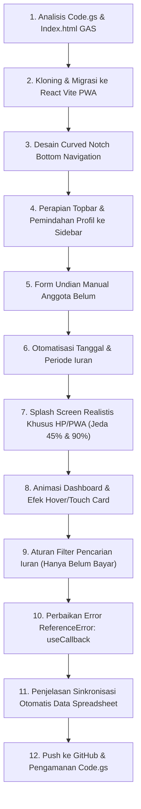
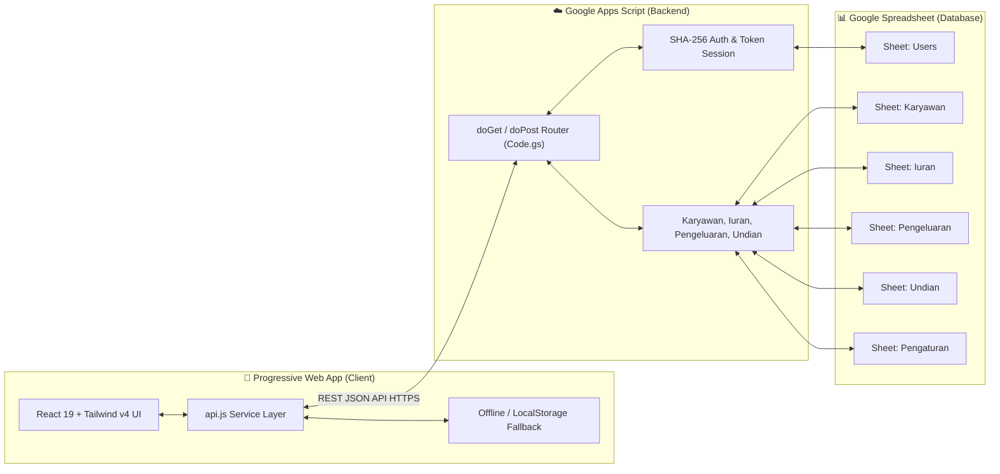

# 📋 Log Sesi Diskusi: E-Anjangsana (SI-ANJANG) UPTD Puskesmas Cermee

> [!NOTE]
> Catatan ini merupakan rangkuman lengkap dari seluruh sesi diskusi pengembangan dan migrasi sistem **E-Anjangsana (SI-ANJANG) V.10.0** milik **UPTD Puskesmas Cermee** dari Google Apps Script (GAS) HTML ke modern **React + Vite + Progressive Web App (PWA)** dengan tetap mempertahankan database live Google Spreadsheet dan tautan iframe lama Blogspot.

---

## 📌 1. Identitas & Informasi Proyek

- **Nama Aplikasi:** E-Anjangsana (SI-ANJANG) V.10.0
- **Instansi:** UPTD Puskesmas Cermee
- **Database:** Google Spreadsheet (Real-time Live Sync)
- **Backend API:** Google Apps Script Web App (`Code.gs` dengan REST JSON API router)
- **Frontend Stack:** React 19, Vite 8, Tailwind CSS v4, Lucide Icons, SweetAlert2, Canvas-Confetti, XLSX
- **Repository GitHub:** [https://github.com/wildanishaq31-spec/si-anjang](https://github.com/wildanishaq31-spec/si-anjang) (Branch: `main`)
- **Target Custom Domain:** `anjangsana.pkmcermee.my.id` (Deploy Vercel)

---

## 🔄 2. Kronologi Sesi Diskusi & Permintaan User

### Rincian Perjalanan Fitur:

### 1. Analisis Kode Awal & Strategi Kloning Aman
- **User Request:** Mempelajari `Code.gs` dan `Index.html` eksisting yang berjalan di Google Spreadsheet dan Blogspot, lalu melakukan migrasi kloning agar iframe Blogspot tetap berjalan normal tanpa gangguan.
- **Implementasi:**
  - Menambahkan REST JSON API router pada `doGet` dan `doPost` di `Code.gs`.
  - Jika dipanggil tanpa parameter `action` (seperti iframe Blogspot lama), `doGet` tetap menyajikan `Index.html`.
  - Jika dipanggil dengan parameter `?action=...` (dari React PWA), mengembalikan data JSON secara cepat.

### 2. Pembangunan Frontend React + Vite + PWA
- Inisialisasi Vite 8, React 19, Tailwind CSS v4 (`@tailwindcss/vite`), icon PWA (192x192, 512x512), manifest PWA, dan konfigurasi Vercel SPA routing (`vercel.json`).

### 3. Navigasi Curved Notch Bottom Bar
- **User Request:** Mengubah bottom navigation bar di mode mobile agar memiliki lekukan melengkung (notch) dengan tombol aktif melayang (*floating active bulb indicator*) sesuai desain referensi modern.
- **Implementasi:** Dibuat di `src/components/BottomNav.jsx` dengan kalkulasi kurva SVG dinamis.

### 4. Perapian Topbar Mobile
- **User Request:** Menghapus tombol hamburger dan profil di topbar mobile karena sudah dipindahkan ke menu Lainnya / Sidebar.
- **Implementasi:** Memperbarui `src/components/Navbar.jsx` (hanya tampil di desktop `lg:flex`) dan memindahkan kartu profil akun pengguna ke bagian bawah `src/components/Sidebar.jsx`.

### 5. Form Undian Tuan Rumah Manual
- **User Request:** Pada menu Undian, modal input manual dibuat memiliki kolom pencarian anggota karyawan yang hanya menampilkan karyawan berstatus *Belum* giliran, serta dropdown otomatis memilih sisa periode bulan yang masih kosong.
- **Implementasi:** Diperbarui di `src/pages/Undian.jsx`.

### 6. Otomatisasi Tanggal & Periode Iuran
- **User Request:** Di form input iuran, kolom tanggal pembayaran dan periode dihapus dari input manual karena otomatis mengikuti hari aktif saat ini.
- **Implementasi:** Form kasir di `src/pages/Iuran.jsx` otomatis menetapkan tanggal hari ini (`YYYY-MM-DD`) dan periode aktif (`Bulan Tahun`).

### 7. Splash Screen Realistis Khusus HP/PWA
- **User Request:** Saat aplikasi dibuka di mode HP/PWA, muncul splash screen dengan poster resmi SI-ANJANG Puskesmas Cermee dan progress bar loading 0–100% yang realistis (ada jeda/pause di 45% dan 90% dengan teks status dinamis seperti menghubungkan ke database).
- **Implementasi:** Dibuat di `src/components/SplashScreen.jsx` dengan poster `splash-pkm.jpg` dan simulasi status database live.

### 8. Animasi Dashboard & Efek Hover/Touch Card
- **User Request:** Memberi animasi saat baru masuk ke Dashboard (*entrance animation*) dan setiap kartu saat di-hover memiliki animasi seperti disentuh atau zoom-in.
- **Implementasi:**
  - Keyframes `fadeInUp` dan utility `card-interactive` di `src/index.css`.
  - Banner, 4 Stat Cards, 5 Kartu Jabatan, dan daftar mutasi di `src/pages/Dashboard.jsx` diberikan transisi hover lift `hover:scale-[1.025] hover:-translate-y-1 hover:shadow-2xl` dan efek sentuh `active:scale-[0.98]`.

### 9. Filter Cerdas Manajemen Iuran (Pencegahan Double Input)
- **User Request:** 
  - Jika nama sudah diinput dan disimpan, di kolom cari nama nama tersebut tidak muncul lagi (hanya nama yang belum bayar).
  - Jika salah input dan transaksi dihapus di tabel riwayat, nama tersebut otomatis muncul kembali di kolom pencarian.
- **Implementasi di `src/pages/Iuran.jsx` & `src/App.jsx`:**
  - Memetakan anggota yang sudah membayar di periode bulan aktif (`paidEmployeeMap`).
  - Dropdown hanya menyajikan `unpaidKaryawanList`.
  - Jika nama yang sudah lunas diketik, muncul banner penjelasan bahwa anggota telah lunas dan arahan untuk menghapusnya di tabel riwayat jika ingin mengoreksi.
  - Optimistic state update pada `handleSaveIuran` dan `handleDeleteIuran` di `App.jsx` sehingga nama langsung hilang/muncul seketika.

### 10. Perbaikan Layar Blank (ReferenceError: useCallback)
- **Masalah:** Saat mengklik menu Iuran, layar menjadi blank dengan error `Uncaught ReferenceError: useCallback is not defined`.
- **Solusi:** Menambahkan import `useCallback` dan `useRef` dari `'react'` pada baris pertama `src/pages/Iuran.jsx`.

### 11. Penjelasan Sinkronisasi Otomatis Google Spreadsheet
- **Pertanyaan User:** Apakah saat dipasang URL Web Script otomatis membaca semua data (user, karyawan, dashboard, iuran, pengeluaran, undian, rekap)?
- **Penjelasan:** YA, 100% otomatis karena semua endpoint `getDashboardStats`, `getUsers`, `getKaryawan`, `getIuran`, `getPengeluaran`, `getUndian`, dan `Rekap` membaca langsung dari sheet Google Spreadsheet.

### 12. Push ke GitHub & Pengamanan File Sensitif
- **User Request:** Push ke repository GitHub `https://github.com/wildanishaq31-spec/si-anjang.git` dengan memastikan file berisiko tidak ikut ter-push.
- **Tindakan Keamanan:**
  - Menghapus `Code.gs`, `Index.html`, dan folder `gas/` dari git tracking (`git rm --cached`).
  - Mendaftarkan `*.gs`, `Code.gs`, `Index.html`, dan `gas/` ke `.gitignore`.
  - Memastikan `.env` tetap ter-ignore.
  - Berhasil push branch `main` ke GitHub.

---

## 🏛️ 3. Arsitektur Alur Sistem (*System Architecture*)

---

## 📂 4. Daftar File Utama & Fungsinya

| File | Deskripsi & Fungsi |
| :--- | :--- |
| `src/App.jsx` | State global (currentUser, iuranList, karyawanList, stats) dan routing halaman. |
| `src/pages/Dashboard.jsx` | Tampilan statistik kasir, 4 kartu utama, rincian per jabatan, dan mutasi kasir. |
| `src/pages/Iuran.jsx` | Form kasir pembayaran iuran, filter cerdas anggota belum bayar, dan tabel riwayat. |
| `src/pages/Undian.jsx` | Fitur pengacakan tuan rumah otomatis (confetti) dan pemilihan manual anggota *Belum*. |
| `src/pages/Karyawan.jsx` | Manajemen data anggota karyawan, nominal iuran, dan status giliran. |
| `src/pages/Pengeluaran.jsx`| Pencatatan kas keluar anjangsana. |
| `src/pages/Rekap.jsx` | Rekapitulasi iuran bulanan/tahunan, ekspor Excel (.xlsx), dan broadcast WhatsApp. |
| `src/pages/Setting.jsx` | Pengaturan running info banner, template WhatsApp, dan konfigurasi URL Web Script. |
| `src/components/BottomNav.jsx`| Navigasi bawah mobile bergaya curved notch dengan active bulb indicator. |
| `src/components/SplashScreen.jsx`| Splash screen bertahap realistis dengan poster Puskesmas Cermee. |
| `src/services/api.js` | Penghubung komunikasi data antara React Frontend dan Google Apps Script. |
| `Code.gs` *(Lokal)* | Script backend untuk dipasang di editor Google Apps Script spreadsheet. |
| `vercel.json` | Konfigurasi SPA routing Vercel agar URL langsung dapat di-refresh tanpa 404. |

---

## 🚀 5. Panduan Singkat Deployment Vercel

1. Buka [https://vercel.com/](https://vercel.com/) dan login.
2. Klik **Add New... > Project** dan import repository **`wildanishaq31-spec/si-anjang`**.
3. Di bagian **Environment Variables**, tambahkan:
   - **Key:** `VITE_GAS_API_URL`
   - **Value:** URL Web App Google Apps Script Anda (yang berakhiran `/exec`).
4. Klik **Deploy**.
5. Buka tab **Settings > Domains**, masukkan domain kustom Anda: **`anjangsana.pkmcermee.my.id`**.
6. Arahkan CNAME DNS di penyedia domain Anda ke `cname.vercel-dns.com`.
